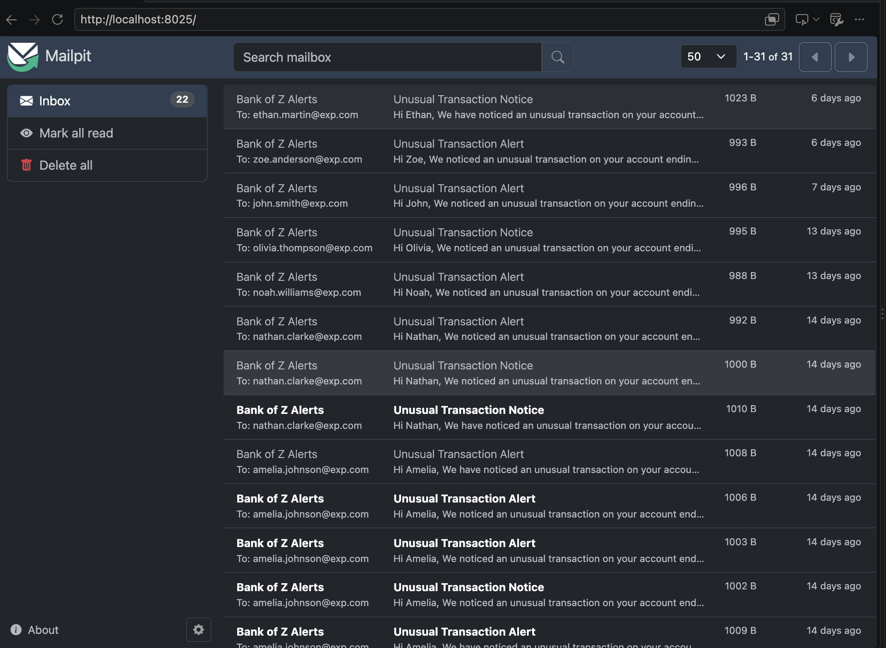

# Bank of Z Transaction Anomaly Detection

**Reporting period:** September 21–October 5, 2026

**Status:** Working proof of concept; three delivery tickets completed.

## Business Case

This workflow helps customers notice unusual account activity and gives operations a traceable record of each alert. It connects transaction simulation, explainable detection, persistent alert tracking, and customer emails in one demonstration.

Synthetic data supports realistic scenarios without production customer records. Existing transaction formats were preserved so generated activity remains available in Bank of Z account history. Python applies the rules, SQLite retains alert history, Groq drafts the wording, and Mailpit captures emails locally.

The current scope demonstrates customer notifications and bank-review classification. It does not confirm fraud, block transactions, or freeze accounts.

## Dataset and Detection Rules

The original approximately 10 transactions were expanded to **3,000 synthetic records**, covering **30 realistic customers, 3 technical test fixtures, and 45 accounts**. The seed includes 30 controlled anomalies (1%). The Open, Fetch, and Close Failure customers are intentional test fixtures.

The live simulator uses 42 accounts linked to active customers. By default, it creates 100 transactions at random 5–12 second intervals, with a 2% anomaly probability per transaction.

| Condition | Rule | Priority | Audience |
| --- | --- | --- | --- |
| Large debit | Absolute debit exceeds the greater of 5,000 or four times the account's median debit | 2 — Medium | Customer |
| Large credit | Credit exceeds the greater of 8,000 or four times the account's median credit | 3 — High | Bank review |
| Unusual time | Transaction occurs before 04:00 | 1 — Low | Customer |
| Rapid activity | At least three account transactions within 120 seconds | 2 — Medium | Customer |

**Example:** If an account's median debit is 100, its large-debit threshold is 5,000. A debit of 7,500 triggers a customer alert with the account, transaction reference, and reason attached.

Multiple rules can match one transaction. The highest matching priority applies; a large-credit reason routes the finding to bank review.

## Delivery Tickets

These retrospective stories follow RAG-07 (September 11–18). Completed status refers to the prototype implementation.

### Anomaly 01 — Generate Synthetic Data and Implement Detection

**Status:** Completed | **Period:** September 21–25, 2026

**User Story:** As a Bank of Z business analyst, I want realistic transaction data and explainable anomaly detection so that I can evaluate unusual account activity and understand why each transaction is flagged.

**Work delivered:** Reviewed customer/account relationships, expanded the seed dataset while preserving formats and test fixtures, and implemented amount, time, and frequency rules with terminal findings and seed-label evaluation support.

**Acceptance evidence:** 3,000 seed transactions; preserved relationships and formats; controlled anomaly labels; account/customer findings with reasons and priorities; evaluation command.

**Code:** [Seed generator](../backend/api/scripts/generate_seed_data.py), [seed SQL](../backend/api/src/main/resources/data.sql), [detect.py](detect.py).

### Anomaly 02 — Simulate Live Transactions and Persist Alerts

**Status:** Completed | **Period:** September 28–30, 2026

**User Story:** As a Bank of Z operations user, I want incoming transactions in account history and persistent anomaly records so that I can trace unusual activity without losing alerts when the application stops.

**Work delivered:** Built weighted transaction simulation through Spring Boot, connected detection to live API reads, and stored findings in SQLite with transaction identity, customer context, audience, and status.

**Acceptance evidence:** API-created transactions visible in account inquiry; live scans; persistent SQLite registry; unique transaction keys; repeated registration without duplicate alert rows.

**Code:** [realtime.py](realtime.py), [bank_api.py](bank_api.py), [alerts.py](alerts.py).

### Anomaly 03 — Integrate Customer Notifications with Groq and Mailpit

**Status:** Completed | **Period:** October 1–5, 2026

**User Story:** As a Bank of Z customer, I want a clear notification about unusual account activity so that I can recognize the transaction or contact the bank, while operations can track the notification result.

**Work delivered:** Added synthetic contacts, Groq drafting and validation, Mailpit SMTP delivery, and notification statuses. Combined processing in `main.py` and restricted its notification/status output to customer alerts registered during the current scan.

**Acceptance evidence:** Customer-only routing; validated Groq drafts; captured Mailpit emails; persistent delivery statuses; current-scan filtering that avoids displaying historical alerts as new.

**Code:** [main.py](main.py), [notification.py](notification.py), [alerts.py](alerts.py).

## How the Workflow Operates

1. **Generate:** `realtime.py` posts transactions through Spring Boot into H2; account history shows them when queried or refreshed.
2. **Detect:** `main.py` invokes `alerts.py`, which reads live transaction history and calls the rules in `detect.py`.
3. **Register:** SQLite stores each new finding using a unique transaction ID. Existing alerts are retained without duplicate insertion.
4. **Notify:** New customer alerts from that scan go to `notification.py`. Groq drafts the message; Python checks required details and submits it to Mailpit.
5. **Record:** SMTP acceptance is followed by `SENT`; handled drafting or per-message delivery failures become `FAILED`.

The email includes the customer's first name, account ending, amount, timestamp, description, and reference. It advises no action if recognized, or contact through an official bank channel if unrecognized. Groq controls wording; Python controls routing and delivery.

Generation is live, while detection runs once per command. Bank-review alerts are stored but are not automatically emailed.

### Workflow Reference


This original design includes future features: Isolation Forest and UI alert badges are not implemented. The registry, Groq, and Mailpit are now implemented despite their dashed styling; the bank-review-to-email arrow is not used. The linked seed generator is the implementation reference for data creation.

### Mailpit Demonstration



The supplied snapshot shows 31 captured messages to synthetic customers. Mailpit is a shared local testing inbox; `SENT` means SMTP accepted a message, not that a customer opened it.

## Files and Stored Data

| File or component | Purpose |
| --- | --- |
| `realtime.py` / `bank_api.py` | Generate transactions and communicate with the banking API |
| `detect.py` | Apply rules and explain findings |
| `alerts.py` | Register and list persistent alerts |
| `main.py` | Run one detection-to-notification cycle |
| `notification.py` | Draft, validate, send, and record notification results |
| `data/alerts.db` | Alert records and `NEW`, `SENT`, or `FAILED` statuses |
| `data/mailpit.db` | Captured emails |

Customer identities and contacts currently come from seed SQL; transaction history comes from the live API. The two SQLite files are separate: deleting a Mailpit email does not reset its alert, and an alert record cannot restore an email body.

## Running the Demonstration

Run from the repository root with the backend already running. Keep the frontend available to demonstrate account history.

**Mailpit — leave running in its own terminal:**

```bash
mailpit --database /Users/temp/Documents/pod/MainframeModernization/anomaly_detection/data/mailpit.db
```

Open [Mailpit](http://localhost:8025). Reusing this database path restores saved messages.

**Simulation — separate terminal:**

```bash
python3 anomaly_detection/realtime.py
```

**Process current transactions:**

```bash
python3 anomaly_detection/main.py
```

By default, `main.py` sends up to one newly registered customer alert. Other alerts remain pending; later runs only consider findings newly registered in those runs. To process the existing pending queue:

```bash
python3 anomaly_detection/notification.py
```

**Inspect or preview:**

```bash
python3 anomaly_detection/alerts.py --list
python3 anomaly_detection/detect.py --evaluate
python3 anomaly_detection/notification.py --dry-run --limit 1
```

The notification preview calls Groq without sending or changing statuses. `main.py --dry-run` still registers findings; send those afterwards with the standalone notifier.

Dependencies are in `requirements.txt`. Local `.env` configuration supplies `GROQ_API_KEY`, optional `GROQ_MODEL` (default `openai/gpt-oss-20b`), SMTP settings (default `localhost:1025`), and `BANK_ALERT_SENDER`.

## Future Scope

- **Bank review UI:** Add an administrator queue, alert badges, and review decisions.
- **Continuous monitoring:** Schedule scans and process new transactions incrementally.
- **Machine learning:** Evaluate Isolation Forest alongside the current rules.
- **Business validation:** Calibrate thresholds and measure false positives using representative scenarios.
- **Delivery reliability:** Strengthen retry and concurrency handling, including failures between SMTP acceptance and status updates.
