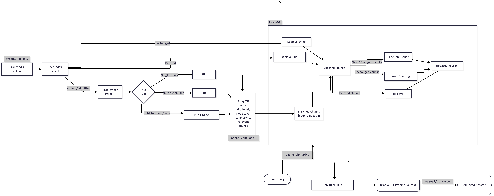
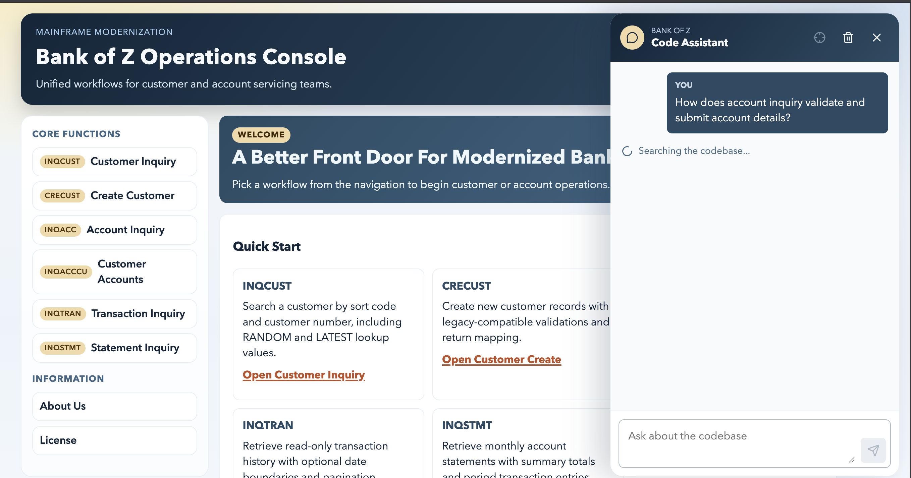
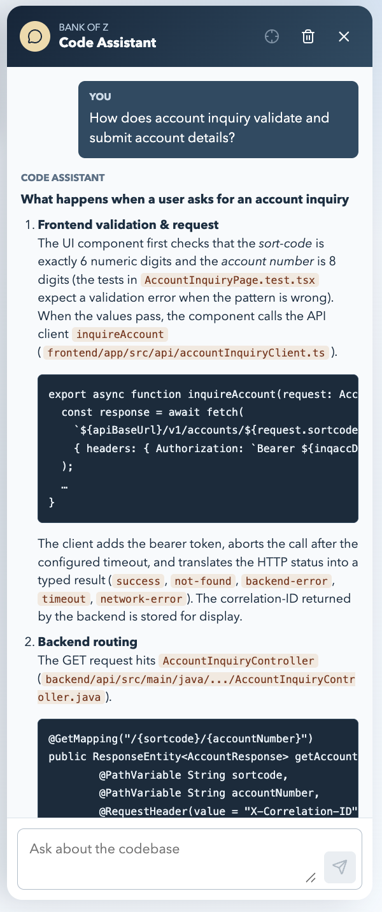
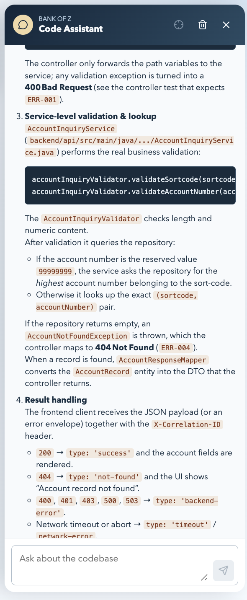
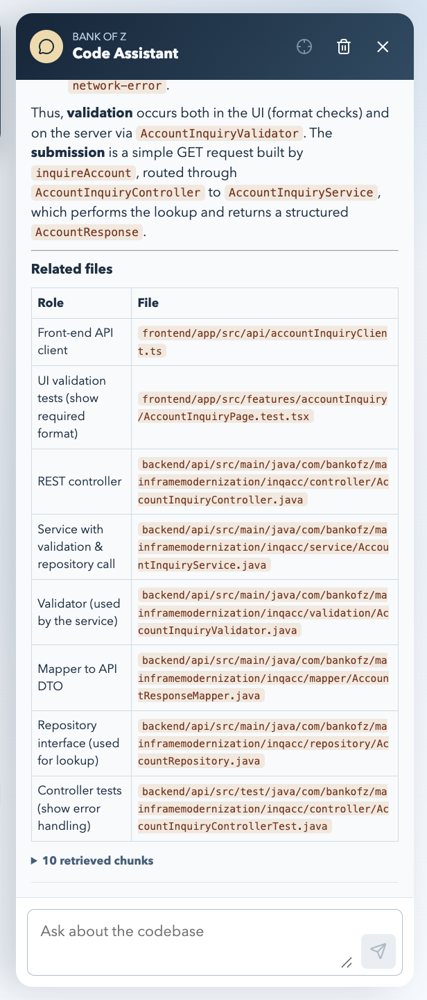

# Bank of Z Codebase RAG

This repository contains an incremental retrieval-augmented generation (RAG)
pipeline for the Bank of Z `frontend/` and `backend/api/` source trees. It combines
CocoIndex change detection, Tree-sitter hierarchy extraction, Groq summaries,
CodeRankEmbed vectors, LanceDB retrieval, and a React code-assistant overlay.

## Workflow



The pipeline follows two connected paths:

1. **Index maintenance:** added or modified files are parsed, chunked, summarized,
   enriched, and embedded; unchanged vectors are retained and deleted chunks are
   removed.
2. **Question answering:** the user's question is embedded, compared with the
   indexed vectors using cosine distance, and the top 10 chunks are supplied to
   Groq with the project prompt to produce a grounded Markdown answer.

The indexed-corpus analysis reports **448 source files, 1,409 syntax nodes, 949
chunks, and approximately 268,049 chunk tokens**. The portable snapshot contains
all 949 ready vectors from the 443 nonempty files represented by chunks; every
vector uses 768 dimensions.

## Requirements

- Python 3.11 or newer
- Node.js and npm for the React UI
- A Groq API key
- Internet access for the initial Python/npm installation and first embedding-model
  download

Create the Python environment from the repository root:

```bash
python3 -m venv rag/.venv
rag/.venv/bin/pip install -r rag/requirements.txt
```

`rag/requirements.txt` pins the main runtime components:

| Component | Purpose |
| --- | --- |
| CocoIndex + Tree-sitter | Incremental source processing and syntax-aware parsing |
| Groq | File/node summaries and final retrieved answers |
| Sentence Transformers | Local query and code embeddings |
| LanceDB | Local vector storage and cosine retrieval |
| FastAPI + Uvicorn | HTTP API consumed by the React overlay |
| PyArrow | Portable Parquet snapshot export/import |

Create an uncommitted `rag/.env` file:

```dotenv
GROQ_API_KEY=your_groq_key_here
```

Never commit this file or an API key. The RAG `.gitignore` already excludes
`rag/.env`.

## Quick Start From The Prebuilt Snapshot

Use this path when the goal is to run the chatbot without repeating ingestion,
chunking, summarization, or document embedding. The portable snapshot is:

```text
rag/embeddings_20260831_095617.parquet
```

It contains the 949 chunk records, source metadata, summaries, input hashes, and
precomputed 768-dimensional vectors.

### 1. Restore LanceDB once

The running application queries LanceDB. Do **not** replace `DATABASE_PATH` in
`rag/api.py` or `rag/search_code.py` with a Parquet filename: Parquet is the
portable distribution artifact, while LanceDB is the query engine. Restore the
local database from the snapshot with this one-time command:

```bash
rag/.venv/bin/python - <<'PY'
from pathlib import Path

import lancedb
import pyarrow.parquet as pq

snapshot = Path("rag/embeddings_20260831_095617.parquet")
rows = pq.read_table(snapshot)

if rows.num_rows == 0 or rows["embedding"].null_count:
    raise RuntimeError("The embedding snapshot is empty or contains missing vectors")

database = lancedb.connect("rag/vector_store")
database.create_table("code_chunks", data=rows, mode="overwrite")
print(f"Restored {rows.num_rows} chunks into rag/vector_store")
PY
```

This copies existing vectors into a queryable local LanceDB table. It does not call
Groq, parse source files, or regenerate embeddings.

### 2. Cache the matching query model once

Document and query vectors must use the same model and revision. The API runs in
offline model mode after startup, so download the pinned model once:

```bash
rag/.venv/bin/python - <<'PY'
from sentence_transformers import SentenceTransformer
from rag.embedding_model import MODEL_NAME, MODEL_REVISION

SentenceTransformer(
    MODEL_NAME,
    revision=MODEL_REVISION,
    trust_remote_code=True,
)
print(f"Cached {MODEL_NAME} at {MODEL_REVISION}")
PY
```

The model is `nomic-ai/CodeRankEmbed`, pinned to revision
`3c4b60807d71f79b43f3c4363786d9493691f8b1`.

### 3. Start the RAG API

```bash
rag/.venv/bin/python -m uvicorn rag.api:app --host 127.0.0.1 --port 8000
```

The React client posts questions to `http://localhost:8000/rag-api/query` by
default. A different endpoint can be supplied through `VITE_RAG_API_URL`.

### 4. Start the frontend

In a second terminal:

```bash
cd frontend/app
npm install
npm run dev
```

Open the URL printed by Vite and use the Code Assistant button in the lower-right
corner.

The command-line retrieval path is also available from the repository root:

```bash
rag/.venv/bin/python -m rag.search_code
```

## Full Incremental Pipeline ####(optional)

This step is only required when there's been significant changes in the code-repo or we don't have any embeddings initially, so use this path after `frontend/` or `backend/api/` changes and a new index snapshot
must be produced. Run every command from the repository root in this order:

```bash
rag/.venv/bin/cocoindex update rag/ingestion.py
rag/.venv/bin/python -m rag.validate_manifests
rag/.venv/bin/python -m rag.analyze_manifests
rag/.venv/bin/python -m rag.ai_summary_input
rag/.venv/bin/python -m rag.generate_ai_summaries
rag/.venv/bin/python -m rag.create_embedding_text
rag/.venv/bin/python -m rag.sync_embedding_table
rag/.venv/bin/python -m rag.embedding_model --device mps
rag/.venv/bin/python -m rag.embeddings_parquet
```

Use `--device cuda` on a supported NVIDIA system. Omit `--device` to let Sentence
Transformers choose a device automatically.

| Order | File | Responsibility |
| ---: | --- | --- |
| 1 | `ingestion.py` | Lets CocoIndex detect source additions, edits, and deletions and writes canonical manifests |
| 2 | `validate_manifests.py` | Verifies IDs, line ranges, source text, and node/chunk relationships |
| 3 | `analyze_manifests.py` | Writes corpus metrics and the latest changed/added/deleted file set |
| 4 | `ai_summary_input.py` | Separates changed files into single-chunk, multi-chunk, and multi-chunk-node summary inputs |
| 5 | `generate_ai_summaries.py` | Calls Groq for concise file and callable-node summaries; completed rows are resumable |
| 6 | `create_embedding_text.py` | Adds summaries to relevant chunks and maintains the complete `input_embeddings/` snapshot |
| 7 | `sync_embedding_table.py` | Reconciles chunks by ID/hash, preserves unchanged vectors, and marks changed vectors pending |
| 8 | `embedding_model.py` | Embeds only pending/stale rows with the pinned CodeRankEmbed model |
| 9 | `embeddings_parquet.py` | Exports the complete current LanceDB table as a timestamped portable snapshot |

`rag/cocoindex.db` stores incremental ingestion state. It is needed by the index
maintainer but not by users running the chatbot from the prebuilt snapshot.
`rag/output/`, `rag/input_embeddings/`, and `rag/vector_store/` are generated local
state and are intentionally not committed.

For a deliberate full-corpus summary rebuild, use:

```bash
rag/.venv/bin/python -m rag.ai_summary_input --all
```

This causes Groq summaries to be regenerated for the full corpus, so it is not part
of a normal incremental refresh.

## Chunking And Incremental Identity

- Source scope: `frontend/` and `backend/api/`
- Exclusions: dependency/build output, package locks, minified vendor assets,
  selected frontend assets, binaries, databases, SVGs, and PNGs
- Chunk target: 2,400 bytes
- Minimum chunk size: 500 bytes
- Chunk overlap: 0 bytes
- File ID: repository-relative source path
- Chunk ID: `<file_id>::chunk-####`
- Vector dimension: 768
- Retrieval: normalized vectors and cosine distance, top 10 chunks
- Answer/summarization model: `openai/gpt-oss-120b`

Tree-sitter extracts class, method, function, and related syntax nodes. CocoIndex's
recursive splitter creates size-bounded chunks, and node line/byte ranges connect
those chunks through `parent_node_id` and `related_node_ids`.

Summary enrichment follows three cases:

1. A single-chunk file receives its file summary in that chunk.
2. Every chunk in a multi-chunk file receives the same file summary.
3. When a callable node spans multiple chunks, its node summary is added only to
   chunks linked to that node.

`sync_embedding_table.py` hashes each final `embedding_text`. Existing vectors are
kept when the chunk text and metadata are unchanged; changed/new chunks become
`pending`, and chunks absent from the new snapshot are deleted.

## Code Assistant UI



The React assistant is mounted as an overlay and does not replace the existing Bank
of Z routes or banking workflows. It supports a loading state, safe Markdown/GFM
rendering, source disclosure, retry/clear controls, and recent chat history. The
annotation control is present as a reserved, currently disabled interaction.

The query flow is:

```text
React overlay -> FastAPI -> CodeRankEmbed query vector -> LanceDB top 10
              -> retrieved code + summaries + project prompt -> Groq answer
```

The response below demonstrates the full presentation path: a grounded explanation,
small relevant code excerpts, backend/service reasoning, result handling, and a
collapsible list of the retrieved chunks.

<table>
  <tr>
    <td width="33%"></td>
    <td width="33%"></td>
    <td width="33%"></td>
  </tr>
  <tr>
    <td align="center">Frontend request and API routing</td>
    <td align="center">Service validation and repository lookup</td>
    <td align="center">Result handling and related evidence</td>
  </tr>
</table>

Relevant integration files:

| File | Role |
| --- | --- |
| `frontend/app/src/features/codeAssistant/CodeAssistantOverlay.tsx` | Drawer state, messages, Markdown output, retry, and source display |
| `frontend/app/src/features/codeAssistant/CodeAssistantOverlay.css` | Isolated overlay styling and responsive layout |
| `frontend/app/src/api/codeAssistantClient.ts` | Typed HTTP client for `/rag-api/query` |
| `frontend/app/src/main.tsx` | Mounts the overlay beside the existing application |
| `rag/api.py` | Embeds the question, retrieves evidence, calls Groq, and returns the answer/sources |
| `rag/search_code.py` | Equivalent interactive command-line retrieval workflow |

## Generated State And Security

Do not commit local credentials, model caches, CocoIndex state, LanceDB transaction
files, generated manifests, or temporary result files. Commit only source code,
documentation, screenshots, and the reviewed portable Parquet snapshot intended for
distribution. Regenerate that snapshot whenever the indexed source corpus changes.
