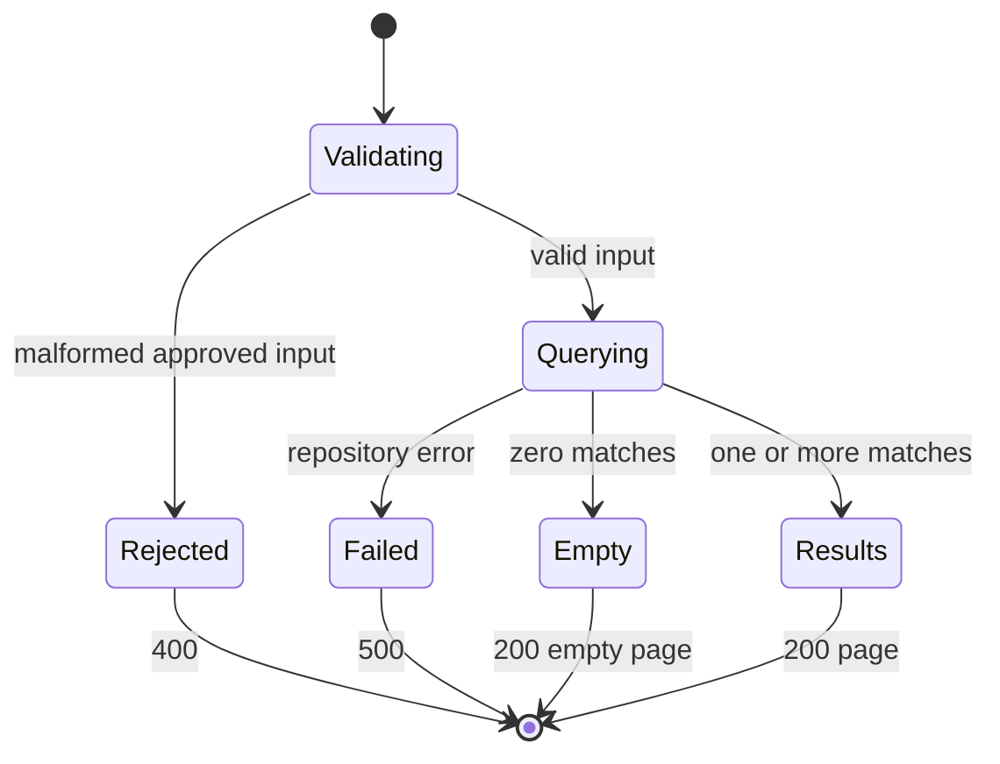

# Feature Specification — Account Transaction List Inquiry

## Feature Description
Provide a read-only transaction list for an account, preserving the observable behavior of `INQTRANL` while integrating into the existing application.

## User Stories

### US-001 — View account transactions
As an operator, I can retrieve transactions for a sort code and account number so that I can inspect the account's transaction history.

### US-002 — Restrict by date
As an operator, I can optionally apply inclusive from/to dates so that I can narrow the result set.

### US-003 — Page through results
As an operator, I can supply limit and offset and see total and returned counts so that I can navigate a large history.

## API Behaviour

`GET /api/v1/accounts/{sortCode}/{accountNumber}/transactions`

Path parameters:
- `sortCode`: exactly 6 digits, represented as a string.
- `accountNumber`: exactly 8 digits, represented as a string.

Query parameters:
- `fromDate`: optional 8-digit `YYYYMMDD` lower boundary.
- `toDate`: optional 8-digit `YYYYMMDD` upper boundary.
- `limit`: optional integer. Omitted or `0` defaults to 50; values above 100 are processed as 100.
- `offset`: optional non-negative integer; omitted defaults to 0.

The exact digit-shape validations reflect copybook widths. Calendar-validity rejection and from-after-to rejection are proposed API safeguards, not evidenced legacy business rules; they must remain visibly traceable as modernization validation.

## Expected Success Response

HTTP 200:

```json
{
	"sortCode": "987654",
	"accountNumber": "12345678",
	"fromDate": null,
	"toDate": "20260728",
	"limit": 50,
	"offset": 0,
	"totalCount": 2,
	"returnedCount": 2,
	"transactions": [
		{
			"transactionId": "987654-12345678-20260728-143015-000000000123",
			"sortCode": "987654",
			"accountNumber": "12345678",
			"date": "20260728",
			"time": "143015",
			"reference": "000000000123",
			"type": "CRD",
			"description": "Example description",
			"amount": 125.50
		}
	]
}
```

The example illustrates shape only; it is not approved seed data.

## Acceptance Criteria

- **AC-001 [FR-001]:** Given records for multiple accounts, only exact sort-code/account matches are returned.
- **AC-002 [FR-002]:** Records on provided from/to dates are included; omitted boundaries do not constrain that side.
- **AC-003 [FR-003]:** Omitted or zero limit yields effective limit 50; a limit above 100 yields effective limit 100.
- **AC-004 [FR-004]:** Offset skips that many rows from the ordered filtered set.
- **AC-005 [FR-005]:** Rows are ordered by date descending and then time descending.
- **AC-006 [FR-006]:** `totalCount` is the filtered pre-page count and `returnedCount` equals the number in `transactions`.
- **AC-007 [FR-007]:** No matches returns 200, zero counts, and `transactions: []`.
- **AC-008 [FR-008]:** ID equals `sortCode-accountNumber-date-time-reference`.
- **AC-009 [FR-009]:** Response transaction fields are exactly those specified; date is `YYYYMMDD`, time is `HHMMSS`, and amount is decimal.
- **AC-010 [FR-010]:** Query execution performs no transaction-data writes.
- **AC-011 [FR-011]:** Repository failure returns 500 and no partial page.
- **AC-012 [FR-012]:** The existing frontend can submit supported inputs, show loading/error/empty states, metadata, and the returned rows.

## Validation Rules

- Sort code: `^[0-9]{6}$`.
- Account number: `^[0-9]{8}$`.
- Dates, when present: `^[0-9]{8}$`; calendar validity is a proposed technical validation requiring approval.
- Limit: integer 0 or greater; effective value defaults/clamps as above.
- Offset: integer 0 through 99999, matching COMMAREA width.
- Proposed: reject fromDate later than toDate with HTTP 400. This is not a legacy business rule and must be SME-approved.

## Error Handling

- HTTP 400 for malformed path/query values under approved boundary validation.
- HTTP 500 for database/repository failure, with a generic error envelope and correlation identifier when available.
- No 404 is defined for no transactions or unvalidated account existence.
- No partial result is returned on technical failure.

## Business Rules Traceability

FR-001→BR-001; FR-002→BR-002/003/004; FR-003→BR-005/006; FR-004→BR-007; FR-005→BR-008; FR-006→BR-009; FR-007→BR-010; FR-008→BR-011; FR-009→BR-012/013; FR-010→BR-014; FR-011→BR-015.

## State Diagram



## Edge Cases

- Offset equals or exceeds total count: successful empty page with preserved total count.
- Limit 0: effective 50.
- Limit >100: effective 100.
- Same date/time across multiple rows: relative order is unspecified.
- Leading-zero identifiers and references must be preserved.
- Null database values require schema/SME resolution before implementation.

## Non-goals

Single transaction detail, account validation, transaction mutation, inferred sentinel account behavior, statement features, categorization, exports, live mainframe integration, or adding fields from the repository's broad transaction schemas unless independently supported and approved.
