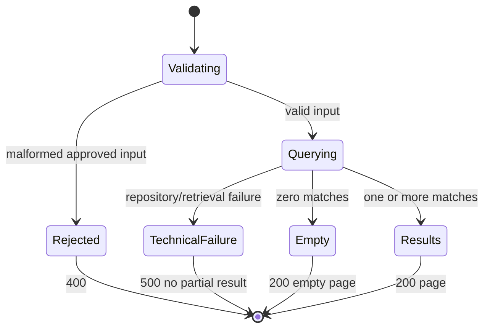

# Feature Specification — Account Transaction Inquiry Capability

## Feature Description
Provide a read-only Account Transaction Inquiry Capability that returns transaction history for a requested account identity while preserving validated legacy filtering, defaults, ordering, pagination, counts, field mappings, empty-result behavior, and technical-failure semantics.

## User Stories

### US-001 — View account transactions
As an operator, I can retrieve transactions for a sort code and account number so that I can inspect the account's transaction history.

### US-002 — Restrict by date
As an operator, I can optionally apply inclusive from/to dates so that I can narrow the result set.

### US-003 — Page through results
As an operator, I can supply limit and offset and see total and returned counts so that I can navigate a large history.

### US-004 — Receive a successful empty inquiry
As an operator, I can receive a successful response with zero returned rows when no transactions match so that I can distinguish no-data outcomes from failures.

### US-005 — Rely on preserved legacy-observable behavior
As an operator, I can rely on preserved filtering, ordering, pagination, count, and field-transformation behavior so that modernization does not change expected inquiry outcomes.

### US-006 — Observe consistent feature outcomes
As an operator, I can observe clear success and technical-failure outcomes with no partial data so that I can trust the response state presented by the existing application.

## API Behaviour

`GET /api/v1/accounts/{sortCode}/{accountNumber}/transactions`

Path parameters:
- `sortCode`: exactly 6 digits, represented as a string.
- `accountNumber`: exactly 8 digits, represented as a string.

Query parameters:
- `fromDate`: optional 8-digit `YYYYMMDD` lower boundary.
- `toDate`: optional 8-digit `YYYYMMDD` upper boundary.
- `limit`: optional integer. Omitted or `0` defaults to 50; values above 100 are processed as 100.
- `offset`: optional non-negative integer; omitted defaults to 0.

Omitted-date processing note:
- Legacy omission handling normalizes omitted boundaries through sentinel conversion and still evaluates both date predicates; final target API semantics for omitted bounds remain an approval gate.

## Expected Success Response

HTTP 200:

```json
{
	"sortCode": "987654",
	"accountNumber": "12345678",
	"fromDate": null,
	"toDate": "20260728",
	"limit": 50,
	"offset": 0,
	"totalCount": 2,
	"returnedCount": 2,
	"transactions": [
		{
			"transactionId": "987654-12345678-20260728-143015-000000000123",
			"sortCode": "987654",
			"accountNumber": "12345678",
			"date": "20260728",
			"time": "143015",
			"reference": "000000000123",
			"type": "CRD",
			"description": "Example description",
			"amount": 125.50
		}
	]
}
```

The example illustrates shape only; it is not approved seed data.

## Response Field Definitions

Top-level response properties:

- The contracted `transactions` row schema is limited to legacy-evidenced fields and transformations only; additional transaction properties are out of contract unless separately approved.

- `sortCode` (string): The requested account sort code context for this inquiry.
- `accountNumber` (string): The requested account number context for this inquiry.
- `fromDate` (string or null): Effective lower-bound inquiry control echo; exact nullability/omission policy remains governed by approved modernization decisions.
- `toDate` (string or null): Effective upper-bound inquiry control echo; exact nullability/omission policy remains governed by approved modernization decisions.
- `limit` (integer): Effective page-size control after documented defaulting/capping behavior.
- `offset` (integer): Effective row-skip control for the ordered filtered set.
- `totalCount` (integer): Number of filtered matching transactions before pagination.
- `returnedCount` (integer): Number of transactions returned in the current response page.
- `transactions` (array): Ordered collection of returned transaction rows for the current page.

Transaction row properties:

- `transactionId` (string): Deterministic composite identifier in `sortCode-accountNumber-date-time-reference` component order.
- `sortCode` (string): Transaction sort code value.
- `accountNumber` (string): Transaction account number value.
- `date` (string): Transaction date in `YYYYMMDD` shape.
- `time` (string): Transaction time in `HHMMSS` shape.
- `reference` (string): Transaction reference value.
- `type` (string): Transaction type value.
- `description` (string): Transaction description value.
- `amount` (number): Transaction amount decimal value.

## Feature Invariants

- The operation is always read-only and does not mutate transaction data.
- Legacy-evidenced field and date-transformation behavior is preserved.
- Omitted-date legacy processing preserves sentinel normalization and always-present bounded date predicates; final omitted-date API semantics require explicit approval.
- Ordering keys are fixed as transaction date descending then transaction time descending; additional tie-break ordering is not contracted.
- Technical retrieval failure never returns partial successful results.
- Existing application compatibility is preserved without altering unrelated functionality.
- Leading-zero identifiers remain preserved in externally visible account and sort-code fields.

## Acceptance Criteria

- **AC-001 [FR-001]:** Given records for multiple accounts, only exact sort-code/account matches are returned.
- **AC-002 [FR-002]:** Records on provided from/to dates are included; when a boundary is omitted, sentinel-normalization processing is preserved and final omitted-boundary API semantics remain an explicit decision gate.
- **AC-003 [FR-003]:** Omitted or zero limit yields effective limit 50; a limit above 100 yields effective limit 100; returned rows never exceed 100 in one successful inquiry.
- **AC-004 [FR-004]:** Offset skips that many rows from the ordered filtered set.
- **AC-005 [FR-005]:** Rows are ordered by date descending and then time descending; no additional tie-break ordering rule is required by this contract.
- **AC-006 [FR-006]:** `totalCount` is the filtered pre-page count and `returnedCount` equals the number in `transactions`.
- **AC-007 [FR-007]:** No matches returns 200, zero counts, and `transactions: []`.
- **AC-008 [FR-006, FR-007]:** Offset at or beyond the filtered total returns HTTP 200 with `returnedCount: 0`, `transactions: []`, and preserved filtered `totalCount`.
- **AC-009 [FR-008]:** ID equals `sortCode-accountNumber-date-time-reference`.
- **AC-010 [FR-009]:** Response transaction fields are exactly those specified; date is `YYYYMMDD`, time is `HHMMSS`, and amount is decimal.
- **AC-011 [FR-010]:** Query execution performs no transaction-data writes.
- **AC-012 [FR-011]:** Repository failure returns 500 and no partial page.
- **AC-013 [FR-012]:** The existing frontend can submit supported inputs, show loading/error/empty states, metadata, and the returned rows.
- **AC-014 [FR-013]:** Validated legacy behavior for filtering, defaults, ordering, pagination, counts, and success/technical-failure outcomes is preserved unless an approved modernization enhancement explicitly supersedes it.
- **AC-015 [FR-014]:** Feature integration does not alter unrelated functionality and remains consistent with established application conventions.

## Validation Rules

Contractual validation rules:

- Sort code: `^[0-9]{6}$`.
- Account number: `^[0-9]{8}$`.
- Dates, when present: `^[0-9]{8}$`.
- Limit: integer 0 or greater; effective value defaults/clamps as above.
- Offset: non-negative integer.

Proposed modernization validations requiring approval:

- Calendar-validity rejection for provided dates.
- Reject `fromDate` later than `toDate` with HTTP 400.
- Treating omitted `fromDate`/`toDate` as unconstrained effective bounds instead of legacy sentinel-normalization behavior.

Contract-boundary note:
- Any decision on nullable date-control echo representation, finalized technical-error envelope shape, and database-native pagination implementation remains an approved modernization decision until explicitly ratified as finalized contract behavior.

## Error Handling

- Business input failures: HTTP 400 for malformed path/query values under approved boundary validation rules.
- Technical failures: HTTP 500 for repository or retrieval failures.
- Technical failure responses use a generic error envelope only when that modernization decision is approved for this feature contract; correlation identifiers are included where platform conventions support them.
- No 404 is defined for empty transaction results or unvalidated account existence.
- No partial successful response is returned on technical failure.
- For omitted-date requests, the contract does not assert unconstrained-bound behavior until the runtime/SME decision gate is resolved.

## Business Rule Traceability

- FR-001 -> BR-001.
- FR-002 -> BR-002, BR-003, BR-004.
- FR-003 -> BR-005, BR-006, BR-007.
- FR-004 -> BR-008.
- FR-005 -> BR-009.
- FR-006 -> BR-010, BR-011, BR-017.
- FR-007 -> BR-012, BR-013.
- FR-008 -> BR-015, BR-019.
- FR-009 -> BR-016.
- FR-011 -> BR-018.

## Document-level Traceability

- FR-010 -> supporting/requirements.md FR-010; supporting/intended-system.md (read-only capability constraint).
- FR-002 -> supporting/requirements.md FR-002 (omitted-date decision gate).
- FR-012 -> supporting/requirements.md FR-012; supporting/intended-system.md (existing application integration intent).
- FR-013 -> supporting/requirements.md FR-013.
- FR-014 -> supporting/requirements.md FR-014; supporting/architecture.md (established architectural conventions).

## Actors

- Primary actor: Operator using the existing application UI to perform the Account Transaction Inquiry Capability.

## Preconditions

- The requester provides a sort code and account number in the documented shapes.
- The transaction inquiry capability is available in the existing application runtime.
- The inquiry service and its backing transaction retrieval path are available to process the request.

## Example Request

`GET /api/v1/accounts/987654/12345678/transactions?fromDate=20260701&toDate=20260728&limit=50&offset=0`

`GET /api/v1/accounts/987654/12345678/transactions?limit=50&offset=0`

## State Diagram



## Edge Cases

- Offset equals or exceeds total count: successful empty page with preserved total count.
- Limit 0: effective 50.
- Limit >100: effective 100.
- Omitted `fromDate`: legacy processing applies sentinel normalization and still evaluates the lower-bound predicate; runtime outcome remains unresolved pending decision gate.
- Omitted `toDate`: legacy processing applies sentinel normalization and still evaluates the upper-bound predicate; runtime outcome remains unresolved pending decision gate.
- Same date/time across multiple rows: no additional tie-break behavior is contracted.
- Leading-zero identifiers and references must be preserved.
- Null database values require schema/SME resolution before implementation.
- Retrieval technical failure during processing: return HTTP 500 with no partial successful page; apply generic error envelope only when approved for this contract.
- Empty filtered result (no matching transactions): return HTTP 200 with `totalCount: 0`, `returnedCount: 0`, and `transactions: []`.
- Empty page due to offset beyond filtered set: return HTTP 200 with preserved filtered `totalCount`, `returnedCount: 0`, and `transactions: []`.

## Non-goals

Single transaction detail, account validation, transaction mutation, inferred sentinel account behavior, statement features, categorization, exports, live mainframe integration, or adding fields from the repository's broad transaction schemas unless independently supported and approved.
