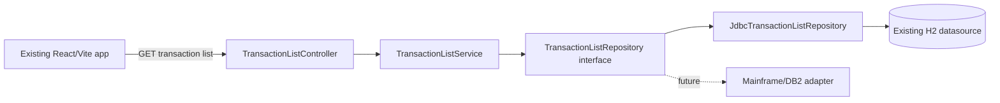

# Architecture

## 1. Purpose
This document describes how the intended modern INQTRAN transaction-list inquiry capability is organized.

It defines architectural structure, layers, responsibilities, interaction boundaries, dependency direction, runtime organization, and extension points while staying consistent with frozen upstream artifacts.

This document does not redefine business rules, requirements, or API contract details.

## 2. Architectural Goals
- Preserve upstream-confirmed inquiry semantics through a stable application architecture.
- Keep the inquiry path read-only.
- Isolate business orchestration from persistence and transport concerns.
- Provide a clear adapter seam for future persistence substitution.
- Support observability, safe technical-failure handling, and maintainable testing seams.

## 3. Architectural Principles
- Layered separation of concerns.
- Dependency inversion at the persistence boundary.
- Behavior preservation first, modernization second.
- Explicit control normalization and output assembly in the application layer.
- Centralized technical-failure translation and safe error presentation.
- Contract and implementation details deferred to downstream artifacts.

## 4. High-Level Architecture

Architectural interpretation:
- Presentation calls application orchestration.
- Application orchestration depends on an abstraction, not a concrete datastore implementation.
- Persistence implementation is replaceable behind the repository interface.

## 5. Runtime Components
- Presentation runtime: existing React and Vite frontend route/view integration.
- Backend transport runtime: request binding and response emission boundary.
- Application orchestration runtime: inquiry coordination, normalization, and result assembly.
- Domain mapping runtime: legacy-shape-compatible value mapping and derived identifier assembly.
- Persistence adapter runtime: current relational adapter and future mainframe-oriented adapter seam.
- Cross-cutting runtime: security filters, configuration, logging, metrics, and correlation support.

## 6. Layer Responsibilities
- Presentation layer:
  - collect supported inquiry inputs,
  - render metadata and rows,
  - render empty-success and technical-failure states.
- Application layer:
  - own orchestration order,
  - own control normalization flow,
  - own no-partial-success rule enforcement.
- Domain layer:
  - own field-shape compatibility and derived output composition responsibilities.
- Persistence layer:
  - provide filtered count and ordered row-retrieval capabilities through repository abstraction,
  - expose technical failures to application layer for centralized handling.
- Infrastructure layer:
  - own configuration loading, logging, metrics/tracing hooks, and environment integration.

## 7. Component Interaction Flow
1. Presentation sends inquiry intent to backend transport boundary.
2. Transport delegates to application orchestration boundary.
3. Application normalizes applicable controls according to preserved semantics.
4. Application requests filtered total count via repository abstraction.
5. Application requests ordered rows and applies offset/limit semantics through the established retrieval path.
6. Domain mapping and derivation produce output shape and metadata.
7. Application returns successful assembled result or technical-failure outcome.
8. Presentation renders result state.

## 8. Dependency Rules
- Presentation may depend on transport contracts and view models only.
- Transport may depend on application interfaces and shared infrastructure utilities.
- Application may depend on domain and repository abstractions.
- Domain must not depend on persistence implementation details.
- Persistence implementations may depend on infrastructure/runtime libraries.
- Concrete persistence adapters must not be referenced directly by presentation or application callers.
- Cross-cutting infrastructure may be consumed by all layers via stable interfaces.

## 9. Validation Responsibilities
- Presentation validation:
  - basic input-shape assistance and user feedback.
- Transport validation:
  - boundary-level structural validation and type-safe binding.
- Application validation/normalization:
  - preserved control normalization behavior and orchestration preconditions.
- Persistence validation:
  - datastore interaction safeguards and technical error signaling.

Validation policy note:
- This architecture assigns validation ownership boundaries; specific validation rules remain defined downstream.

## 10. Error Handling Architecture
- Technical failures in count or retrieval paths propagate as technical errors, not partial successful responses.
- Error translation is centralized at backend boundary/infrastructure handling points.
- Error payload/logging strategy must avoid leaking sensitive internals while retaining operational diagnosability.
- Legacy ABNDPROC and ABNDFILE behavior is represented as modern logging and monitoring responsibility, not as recreated business functionality.

## 11. Persistence Architecture
- Repository abstraction defines required inquiry operations for:
  - pre-pagination filtered count,
  - ordered transaction retrieval for page assembly.
- Current adapter targets repository-standard relational runtime.
- Future adapter path allows substitution for mainframe or DB2 integration without changing presentation/application orchestration contracts.
- Persistence remains read-only for this capability.

## 12. Configuration Boundaries
- Presentation configuration:
  - UI routing and backend endpoint base configuration.
- Backend configuration:
  - feature enablement, data source binding, environment profile selection.
- Infrastructure configuration:
  - logging levels, correlation behavior, metrics/export settings.
- Secret management and production runtime wiring are externalized to deployment and platform conventions.

## 13. Observability
- Backend emits structured operational logs for inquiry execution lifecycle and technical-failure paths.
- Metrics should capture request volume, latency, and technical-failure counts for inquiry capability.
- Correlation context should flow through presentation to backend logs where platform conventions support it.
- Observability must remain operational and diagnostic, not a source of business behavior.

## 14. Security Boundary
- Security enforcement is handled at established application security boundaries.
- Inquiry feature participates in existing global security and error-handling policies.
- This architecture does not define new authorization semantics; feature-specific policy decisions remain downstream.

## 15. Extensibility
- Repository abstraction provides the primary seam for adding alternative persistence adapters.
- Domain and application separation allows future enrichment of mapping/derivation logic without transport or persistence rewrites.
- Related detail inquiry capability remains separate and can be introduced as an independent vertical slice.

## 16. Deployment View
- Frontend and backend are deployed as modern application components consistent with current repository runtime.
- Current persistence runtime for this feature uses existing project datasource conventions.
- Future runtime topology may swap persistence adapter implementations while preserving application-layer orchestration boundaries.
- No recreation of CICS runtime assets is required for this feature deployment.

## 17. Testing Architecture
- Presentation tests validate user interaction state transitions and rendering outcomes.
- Backend transport tests validate boundary behavior and integration with application orchestration.
- Application-layer tests validate orchestration sequence, normalization ownership, and no-partial-success enforcement.
- Persistence adapter tests validate read-only data access behavior through repository contracts.
- End-to-end tests validate cross-layer integration from user input to rendered results.

## 18. Legacy-to-Modern Replacement
CICS COMMAREA becomes typed HTTP DTOs; cursor logic becomes repository queries; ABNDPROC and ABNDFILE are replaced by application logging, monitoring, and safe technical errors. The legacy error store is not recreated because it is operational infrastructure rather than business behavior.

## 19. Scope Boundaries
A detail controller or service for INQTRAND is deliberately absent. The list composite identifier may support that later feature, but no direct runtime linkage is introduced until a separate specification is approved.

## 20. Architectural Risks
- Date representation compatibility uncertainty between legacy declarations and host-variable conversion evidence.
- Nullable-source handling uncertainty where indicator-variable behavior is not evidenced upstream.
- Ambiguity for type-compatibility edge cases where legacy numeric-display and character representations intersect.
- Ordering tie ambiguity for rows sharing the same date and time.
- Security policy finalization risk if downstream contract decisions diverge from current shared conventions.

## 21. Upstream Alignment

| Architectural decision | Intended System | Program Analysis | Dependency Map | Business Rules | Mapping Matrix | Status |
|---|---|---|---|---|---|---|
| Keep the capability as a read-only transaction-list inquiry slice | Confirms capability scope and read-only intent | Confirms inquiry-only runtime behavior | Confirms read-path dependencies | Confirms read-only behavior rule | Confirms read-path mappings | Confirmed upstream constraint |
| Separate presentation, application, domain, persistence, and infrastructure responsibilities | Defines high-level frontend/backend/persistence boundaries | Shows legacy runtime concerns to replace, not duplicate | Defines inbound and outbound dependency concepts | Constrains orchestration outcomes | Shows transformation and control ownership needs | Architectural design decision |
| Use repository abstraction with replaceable concrete adapter | Supports modernization direction and future-proofing | Confirms DB access role in legacy | Shows DB2 dependency and separable runtime concerns | Constrains behavior preservation independent of storage tech | Defines data-flow points abstraction must preserve | Approved modernization direction |
| Application layer owns normalization and orchestration order | Confirms control normalization and flow intent | Confirms count-then-retrieval sequence in legacy | Confirms core runtime dependency sequence | Confirms normalization and count/retrieval success semantics | Confirms host/intermediate normalization and count mapping | Confirmed upstream constraint |
| Enforce no partial successful result on technical retrieval failure | Confirms expected failure outcome | Confirms abend path on technical SQL failures | Confirms error-only auxiliary dependency path | Confirms no-partial-success rule | Confirms success and failure mapping boundaries | Confirmed upstream constraint |
| Keep observability as replacement for legacy operational abend store behavior | Supports modernization operational direction | Confirms ABNDPROC operational role | Confirms ABNDFILE is operational dependency via error path | Aligns with technical-failure behavior | Keeps mapping focused on business output fields | Approved modernization direction |
| Preserve ordering and pagination semantics while not fixing a third tie-breaker | Confirms preserved behavior constraints | Confirms SQL ordering and loop pagination approach | Confirms read-sequence dependencies | Confirms ordering and pagination rules | Confirms control and count mappings | Confirmed upstream constraint plus remaining uncertainty |
| Defer exact contract, security policy detail, and unresolved field edge semantics to downstream artifacts | Confirms deferral boundaries | Identifies unresolved legacy uncertainties | Identifies missing runtime definitions | Marks behavior-only constraints | Marks provisional mappings and uncertainties | Remaining uncertainty |
