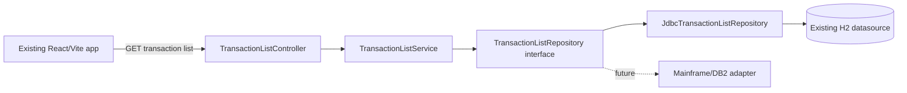

# Architecture

## Responsibilities
- **Frontend:** capture only supported inputs and render page metadata/rows/states.
- **Controller:** HTTP binding, approved validation, delegation.
- **Service:** legacy-equivalent defaults, clamp, orchestration, no-partial-result rule.
- **Mapper/domain:** fixed-width and date/decimal mappings, composite ID.
- **Repository:** parameterized filter/count/page queries and persistence error translation.
- **Global/shared infrastructure:** security, correlation, safe error serialization, observability.

## Legacy-to-modern replacement
CICS COMMAREA becomes typed HTTP DTOs; cursor logic becomes repository queries; `ABNDPROC/ABNDFILE` is replaced by application logging/monitoring and safe technical errors. The legacy error store is not recreated because it is operational infrastructure rather than business behavior.

## Scope boundary
A detail controller/service for `INQTRAND` is deliberately absent. The list's composite ID may support that later feature, but no link is implemented until a separate specification is approved.
