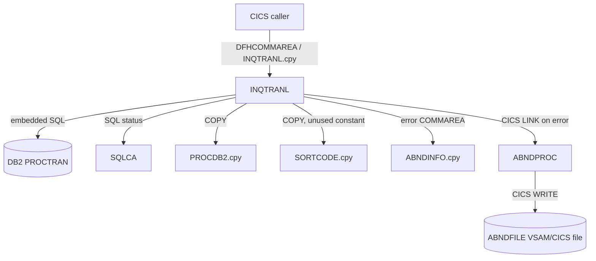

# Dependency Map

## Direct INQTRANL dependencies

## Related program decision

`INQTRAND` reads one `PROCTRAN` row by sort code, account number, date, time, and reference. Its input aligns with fields embedded in each INQTRANL composite transaction ID. However:

- INQTRANL contains no `CALL`, `LINK`, `XCTL`, or transaction reference to INQTRAND.
- INQTRAND contains no reference to INQTRANL.
- No UI/navigation evidence was supplied.

**Decision:** same broad business capability, separate future modernization feature. It is not required to implement or verify the INQTRANL list operation.

## Missing runtime definitions
- CICS program and transaction definitions.
- `ABNDFILE` definition/record metadata beyond `ABNDINFO`.
- DB2 DDL/indexes and bind configuration.
- JCL/deployment assets.
