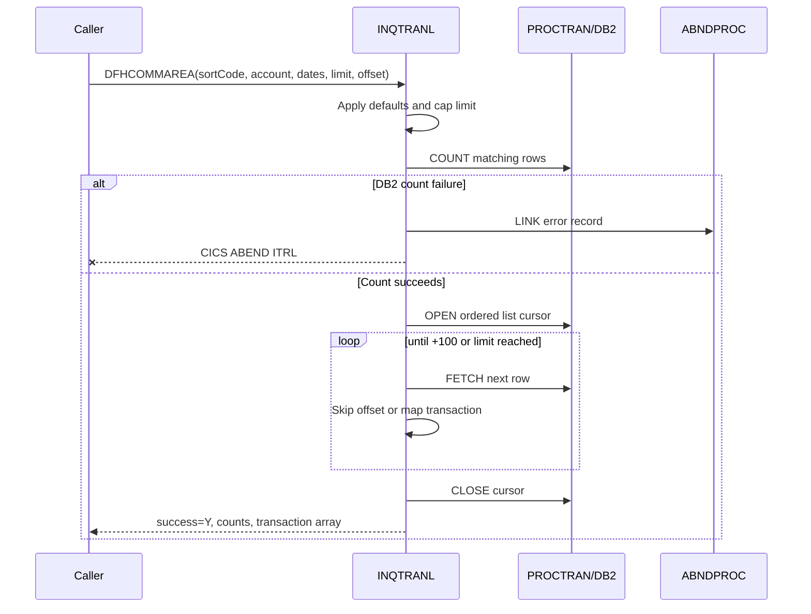

# Program Analysis — INQTRANL

## Evidence classification

- **Evidence:** directly present in supplied source.
- **Inference:** a constrained conclusion from multiple evidence points.
- **Assumption:** not established and requiring validation before implementation.

## 1. Program Purpose

**Evidence:** The source comment and SQL state that `INQTRANL` retrieves transactions for one sort code/account number, optionally bounded by dates, with limit/offset pagination. It returns total count, returned count, and up to 100 transaction rows.

## 2. Business Capability

**Inference:** Account transaction list inquiry. The primary observable operation is list retrieval, not account validation, statement generation, posting, or transaction detail retrieval.

`INQTRAND` is in the same broad capability family but is a separate detail operation. **Evidence:** it accepts the list row's composite key fields and retrieves one row, but neither program calls or links to the other.

## 3. Inputs

| Field | Legacy type | Evidence-backed behavior |
|---|---|---|
| `INQTRANL-EYE` | X(4) | If not `ITRL`, program overwrites it with `ITRL`; it does not reject the call. |
| `INQTRANL-SORTCODE` | 9(6) | Used as exact `PROCTRAN_SORTCODE` predicate. |
| `INQTRANL-ACCNO` | 9(8) | Used as exact `PROCTRAN_NUMBER` predicate. |
| `INQTRANL-FROM-DATE` | 9(8) | `0` means absent and is replaced with `00000000`; converted mechanically to `0000-00-00`. |
| `INQTRANL-TO-DATE` | 9(8) | `99999999` is the no-to-date sentinel and remains the effective maximum; converted to `9999-99-99`. |
| `INQTRANL-LIMIT` | 9(3) | `0` becomes 50; values over 100 become 100. |
| `INQTRANL-OFFSET` | 9(5) | Rows are fetched and skipped in COBOL until the offset is reached. |

**Important evidence issue:** comments say date inputs use `YYYYMMDD`, but no calendar validation exists. Modern date validation is not legacy-evidenced and therefore remains an explicit design question.

## 4. Outputs

- Total rows matching account/date predicates, before pagination.
- Returned row count after offset/limit processing.
- Success flag set to `Y` after both DB2 operations finish.
- Up to 100 rows containing transaction ID, sort code, account number, date, time, reference, type, description, and amount.
- Composite ID format: `{sortCode}-{accountNumber}-{YYYYMMDD}-{HHMMSS}-{reference}` in a 50-character field.

No output error code or error message is defined in `INQTRANL.cpy`. DB2 failures use CICS abend handling instead of a business response.

## 5. File Dependencies

`INQTRANL` has no COBOL `SELECT`, `FD`, VSAM read/write, transient-data, or temporary-storage operation.

The linked `ABNDPROC` writes the `ABNDINFO` record to CICS file `ABNDFILE` using `ABND-VSAM-KEY`. This is an indirect operational dependency, not transaction data storage.

## 6. Copybook Dependencies

| Copybook | Role |
|---|---|
| `INQTRANL.cpy` | Primary COMMAREA input/output contract and 100-row array. |
| `PROCDB2.cpy` | DB2 declaration for `PROCTRAN`. |
| `SORTCODE.cpy` | Declares constant `SORTCODE = 987654`; included but not referenced by processing statements. |
| `ABNDINFO.cpy` | Error record passed to `ABNDPROC`. |
| `SQLCA` | DB2 SQL status area; platform include. |

## 7. Database Dependencies

Table: `PROCTRAN`.

Columns selected: `PROCTRAN_EYECATCHER`, `PROCTRAN_SORTCODE`, `PROCTRAN_NUMBER`, `PROCTRAN_DATE`, `PROCTRAN_TIME`, `PROCTRAN_REF`, `PROCTRAN_TYPE`, `PROCTRAN_DESC`, `PROCTRAN_AMOUNT`.

Predicates: exact sort code and account number; inclusive date range (`>=`, `<=`).

Ordering: date descending, then time descending. No tertiary tie-breaker is present.

Cursors:

1. `TRAN-COUNT-CURSOR` executes `COUNT(*)` for the full filtered result.
2. `TRAN-CURSOR` fetches matching rows in descending date/time order `FOR FETCH ONLY`.

Pagination is performed in COBOL, not SQL: fetch and discard `offset` rows, then collect until `limit` rows or SQLCODE `+100`.

## 8. External Program Calls

`EXEC CICS LINK PROGRAM('ABNDPROC') COMMAREA(ABNDINFO-REC)` occurs on DB2 errors and the registered CICS abend path.

`ABNDPROC` writes the error record to `ABNDFILE`. It does not contribute transaction inquiry business data.

No call/link to `INQTRAND` exists.

## 9. CICS Dependencies

- `PROCEDURE DIVISION USING DFHCOMMAREA`.
- `HANDLE ABEND LABEL(ABEND-HANDLING)`.
- `ASSIGN APPLID`, `ASSIGN PROGRAM`.
- EIB fields `EIBRESP`, `EIBRESP2`, `EIBTASKN`, `EIBTRNID`.
- `ASKTIME`, `FORMATTIME`, `LINK`, `ABEND`, and `RETURN`.
- Program abend code `ITRL` for explicit DB2 failure.

CICS transaction definitions, DB2ENTRY/DB2TRAN mappings, and security resources were not supplied.

## 10. IMS Dependencies

The compiler option includes `DLI`, but `INQTRANL` contains no DL/I statement, PCB, PSB, or IMS call. IMS is not a confirmed runtime dependency for this program.

## 11. MQ Dependencies

None found.

## 12. Error Handling

- Any nonzero SQLCODE from count cursor open/close or list cursor open/close triggers `ABEND-ROUTINE`.
- Count fetch accepts SQLCODE `0` or `+100`.
- Row fetch treats `+100` as normal end-of-data and other nonzero values as failure.
- DB2 failure is recorded through `ABNDPROC`, followed by `EXEC CICS ABEND ABCODE('ITRL') CANCEL NODUMP`.
- A general CICS abend is recorded through `ABNDPROC`, then the handler executes `CICS RETURN`.

**Inference:** the modern boundary needs a technical-failure response, but legacy source does not define HTTP status or JSON error content.

## 13. Success Conditions

Success is set to `Y` after count retrieval, transaction retrieval, and cursor closure complete without an error path. Zero matching rows are successful: total and returned counts stay zero and SQLCODE `+100` ends the fetch loop normally.

## 14. Failure Conditions

Confirmed technical failures are DB2 open/fetch/close errors and CICS abends. No account-not-found, malformed-input, authorization, or business failure state is represented by the COMMAREA.

## 15. Transaction Flow

1. Initialize counters and register CICS abend handler.
2. Normalize eyecatcher and defaults.
3. Cap limit at 100.
4. Convert numeric date structures to DB2 character date values.
5. Count all matching rows.
6. Open ordered transaction cursor.
7. Skip offset rows in the COBOL loop.
8. Map up to limit rows and build composite IDs.
9. Close cursor, set counts and success, and return.

## 16. Sequence Diagram

## 17. Modernization Candidate Assessment

Good candidate for a read-only Spring Boot query feature because the source has a bounded data contract, deterministic filters, explicit ordering, and repository-friendly SQL. Complexity is moderate due to pagination semantics, fixed-width identifiers, date sentinels, composite IDs, nullability gaps, and integration with an existing multi-feature application.

## 18. Ambiguities and Open Questions

1. Are invalid calendar dates rejected by an upstream caller, DB2, or neither?
2. Should omitted dates map to unbounded SQL predicates rather than legacy sentinel strings?
3. What modern response is required for technical failures?
4. Does account existence matter independently of transaction existence?
5. Are nullable DB2 columns populated in production, and how are null indicators handled? No indicators appear in source.
6. Is date/time ordering sufficient when two rows share both values?
7. Can reference contain non-digits? DB2 says `CHAR(12)`, but COMMAREA says numeric.
8. Is amount precision/sign exactly preserved by the target H2 schema and JSON serialization?
9. Which repository OpenAPI file is authoritative?
10. What security policy applies to this route?
